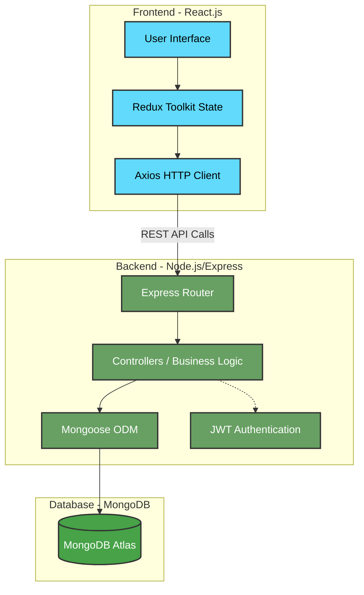

# College Management System 🎓

Hi everyone! This is my academic semester project for College Management System. I built this to manage the daily operations of a college like tracking student attendance, managing faculties, and keeping academic records. 

I used the MERN stack for this project. It was a great learning experience, especially working with Redux for state management!


## ✨ Features Included

### Admin Module
- **School Management**: Register and configure the institution.
- **Class & Subject Management**: Create classes and assign subjects to them.
- **Faculty Management**: Hire teachers and assign them to specific subjects and classes.
- **Student Management**: Enroll students and monitor their overall performance.
- **Notice Board**: Post global notices visible to all students and teachers.

### Teacher Module
- **Classroom Control**: View assigned classes and student lists.
- **Attendance Tracking**: Mark daily attendance for students.
- **Marks Entry**: Upload examination marks securely.
- **Subject Overview**: Monitor the curriculum and complain resolution.

### Student Module
- **Personal Dashboard**: View profile and enrolled subjects.
- **Attendance Viewer**: Track daily and overall attendance percentages.
- **Marks & Results**: View uploaded exam marks.
- **Complaint System**: Submit complaints to the administration.

## 🏗 Architecture

This project follows a standard 3-tier Client-Server architecture:



1. **Client Tier (Frontend)**: Built with React.js and Material UI. It handles the user interface and captures user inputs. State management is handled globally using Redux Toolkit.
2. **Application Tier (Backend)**: Built with Node.js and Express.js. It exposes RESTful APIs to the frontend, processes business logic, handles user authentication (JWT), and manages data validation.
3. **Data Tier (Database)**: MongoDB is used as the primary database, managed via Mongoose ODM. It stores schemas for Admins, Students, Teachers, Classes, Subjects, and Notices.

## 📂 Code Structure

Here is a brief overview of how the repository is organized:

```text
📦 College-Management-System-project
 ┣ 📂 backend                 # Express.js server & APIs
 ┃ ┣ 📂 controllers           # Request handlers and business logic
 ┃ ┣ 📂 models                # MongoDB database schemas (Mongoose)
 ┃ ┣ 📂 routes                # Express API route definitions
 ┃ ┣ 📜 index.js              # Entry point for the server
 ┃ ┗ 📜 package.json          # Backend dependencies
 ┣ 📂 frontend                # React.js application
 ┃ ┣ 📂 public                # Static assets
 ┃ ┣ 📂 src                   # React source code
 ┃ ┃ ┣ 📂 assets              # Images and icons
 ┃ ┃ ┣ 📂 components          # Reusable UI components (Popups, Charts)
 ┃ ┃ ┣ 📂 pages               # Main page layouts (Admin, Teacher, Student)
 ┃ ┃ ┣ 📂 redux               # Redux Toolkit slices and global store
 ┃ ┃ ┣ 📜 App.js              # React Router definitions
 ┃ ┃ ┗ 📜 index.js            # React DOM entry point
 ┃ ┣ 📜 netlify.toml          # Deployment configuration
 ┃ ┗ 📜 package.json          # Frontend dependencies
 ┗ 📜 README.md               # Project documentation
```

## ⚙️ How to run this project on your PC

You need to have Node.js and MongoDB installed before running this.

### 1. Backend Setup
1. Open terminal and go into the backend folder:
   `cd backend`
2. Install the required npm packages:
   `npm install`
3. Create a `.env` file inside the backend folder and add your MongoDB connection string:
   `MONGO_URL = your_mongo_connection_string`
4. Start the server:
   `npm start`

### 2. Frontend Setup
1. Open a new terminal and go into the frontend folder:
   `cd frontend`
2. Install the dependencies:
   `npm install`
3. Run the react app:
   `npm start`

## 📚 What I Learned
During this project, I learned how to connect a React frontend to an Express backend. Setting up Redux Toolkit took some time to understand, but it made managing the user states much easier than passing props everywhere. I also learned how to use Material UI for making the dashboard look clean.

---
*Developed gradually over the semester (August - November 2024). Feel free to explore the code!*
